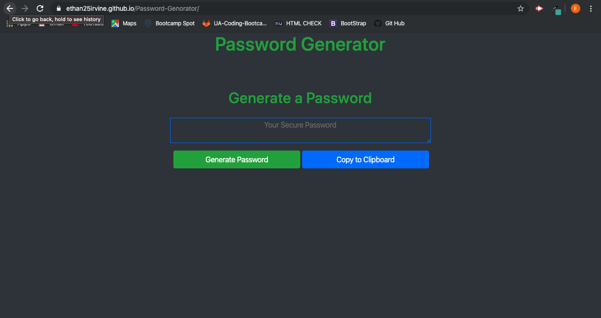

# Password-Generator

This is my first project using Javascript.

This webpage is designed to allow the user to create a secure password with full customization. The page is fairly simply, click the generate prompt and you will be sent a prompt asking how many characters you want, then it will go into 4 other questions about the type of characters you want in the password. Once everything is finished you will see your new password on the screen, you can then click the 'Copy to Clipboard' button and it will automatically copy the password and you can just paste it where ever you need. 

<!-- Photo of the page -->

<!-- Link to the page  -->
https://ethan25irvine.github.io/Password-Genorator/